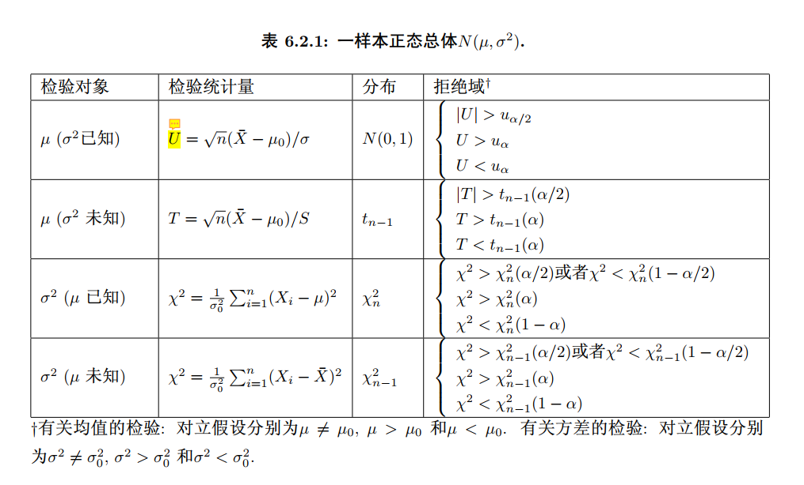
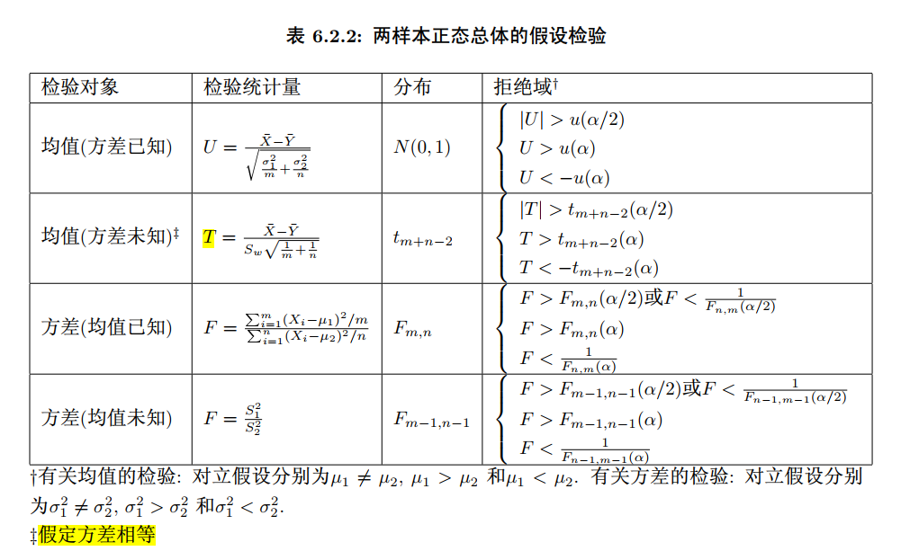

# Probability Is All You Need

* History
* Descriptive Statistics
* Definition of Probability
* Probability and Distribution, Expectation, Variance
* Probability and Central Limit Theorem
* Probability and Hypothesis Test
* Probability and Bayes
* Probability and Stochastic Process

# History

The birth of statistics

* Math: Pascal and Fermat's researches on gambling. Since 1654.

* Physics: Einstein, Perrin, Langevin, Ito's researches on Brownian Motion. Since [1905](https://en.wikipedia.org/wiki/Albert_Einstein).
* Biology: Galton, Pearson, Fisher's researches on Eugenics. Since [1883](https://en.wikipedia.org/wiki/Francis_Galton).

* NLP: Markov's researches on Pushkin's poem *Eugene Onegin*. Since [1913](https://knowdisdata.com/articles/Pushkin%20and%20Markov%20Chains.pdf).

In the math part, Bernouli, De Moivre, Laplace, Poisson also made great contributions. In 1900, Hilbert's sixth question is about the axiomatization of probability and physics. In 1933, Kolmogorov did that.

But the true birth of statistics relied on the latter 3 parts, especially biology. **From the birth, statistics has deep connections with biology, physics and NLP.**

# Descriptive Statistics

In primary school, junior high school and senior high school, we learnt a lot about the so-called "descriptive statistics".

For example
* boy-girl-ratio: [France](https://www.google.com/search?q=1745-1784%2C+Paris%2C+statistics%2C+Laplace&sca_esv=578365596&sxsrf=AM9HkKlxgFTSWweFNSD_u7CI5NTJZcbMUA%3A1698807479307&ei=t75BZYq1Eta0oAT5-ZyADQ&ved=0ahUKEwjK7OGC56GCAxVWGogKHfk8B9AQ4dUDCBA&uact=5&oq=1745-1784%2C+Paris%2C+statistics%2C+Laplace&gs_lp=Egxnd3Mtd2l6LXNlcnAiJTE3NDUtMTc4NCwgUGFyaXMsIHN0YXRpc3RpY3MsIExhcGxhY2VI2B9QpxBYkx5wAXgBkAEBmAGkBKABpQ-qAQswLjcuMC4xLjAuMbgBA8gBAPgBAcICChAAGEcY1gQYsAPCAgUQABiiBMICBBAhGBXiAwQYACBBiAYBkAYI&sclient=gws-wiz-serp). [China](https://en.wikipedia.org/wiki/Demographics_of_China).
  * In 1814, Laplace wrote in "[A Philosophical Essay on Probabilities](https://en.wikipedia.org/wiki/A_Philosophical_Essay_on_Probabilities)" that the ratio of male to female infants in London, Berlin, and throughout France was 104.76:100, while in Paris it was 104.17:100.

* basketball, soccer: see [kaggle](https://www.kaggle.com/).
* weighted average: like grades weighted by points.

But we can't just do this kind of thing, we must go beyond, build a model. Sometimes people call this "statistical inference". Here are 3 important things we need to do.

* population: just like the population of a country. (Your Model)
* sample: both a number and a random variable. (Your Data)
* f -> p

# Definition of Probability

* Just like throwing a coin
* Measure

# Probability and Distribution, Expectation, Variance

* Distribution: Discrete and Continuous
* E, Var: See them as Operator!
  * $E(b) = E_{x}(E_{b}(b|x))$
  * $Var(b) = E_x(Var_b(b|x)) + Var_x(E_b(b|x))$
  * [MSE = Bias + Variance + Noise](https://en.wikipedia.org/wiki/Bias%E2%80%93variance_tradeoff)
  * $E(\frac{1}{n-1}  \sum_{i=1}^n (X_i - mean \ of \ the \ data)^2) = Var(X)$ 

Example from RL: remember the slot machine in class?

I must emphasize that the distribution has more information than E, Var. That means, when you get a data in your project, first plot its distribution!

# Probability and Central Limit Theorem

[Wikipedia.](https://en.wikipedia.org/wiki/Central_limit_theorem)

In the simplest form,
$$
\forall i, X_i \ i.i.d. \Rightarrow \sum_{i=1}^{n} X_i \overset{d}{\to}N(nE(X_i),nVar(X_i))
$$
And this is the true reason why Gauss choose $e^{-x^2}$ instead of $cos(x), e^{-x^4}, (\frac{1}{1+e^{-x}})^{\prime}, (arctan(x))^{\prime}$ and so on.

There is an example from neuroscience, which I will call the core of biological neural network. Based on Central Limit Theorem, a neuron in a big neural network should have $\frac{\sigma}{\mu} \to 0, as \ n \to \infty$, but this contradicts with the experiment result, which show finite $\frac{\sigma}{\mu}$.

There are 2 solutions

* balanced exhibition and inhibition
* correlated inputs

# Probability and Hypothesis Test

[Lady Tasting Tea](https://en.wikipedia.org/wiki/Lady_tasting_tea)

Other hypothesis test: $\chi^2$, t, F, permutation test, rank, KS, ...

Further Reading

* [Do you believe that certain zodiac signs are more compatible with each other?](https://physics-lee.github.io/2022/07/07/12_Constellations_and_Marriage/)

* [The Misuse of p-value in the Senior High School](https://physics-lee.github.io/2022/08/10/The_Misuse_of_p-value_in_the_Senior_High_School/)

* [p-hacking: What it is and how to avoid it!](https://www.youtube.com/watch?v=HDCOUXE3HMM)

* Example from Neuroscience: [Sen Song's work](https://github.com/Wenlab/Computation-Neuro-Course/issues/55)

## Fisher vs Mendel

## Common Hypothesis Tests

# Probability and Bayes

* Hypothesis Test
* [Three door problem](https://en.wikipedia.org/wiki/Monty_Hall_problem)
* Three choice problem

# Probability and Stochastic Process

## Basic

* Markov Process
* Poisson Process
* Steady Process

## Stochastic Process and Neuroscience

### Count

### Error-Bar

(figure from the Internet)

### The-stimulus-before-spikes

# Homework

1. Search the boy-girl-ratio of Japan, China, India, Turkey and Israel, write down what you see.

2. prove

* $E(b) = E_{x}(E_{b}(b|x))$
* $Var(b) = E_x(Var_b(b|x)) + Var_x(E_b(b|x))$
* MSE = Bias + Variance + Noise
* $E(\frac{1}{n-1}  \sum_{i=1}^n (X_i - mean \ of \ the \ data)^2) = Var(X)$ 

3. In the lady-testing-tea-problem, calculate $P$(more than 8 cups are right|no distinguishing ability)
4. In the 3-door-problem, calculate $P(H_A|data)$ and $P(H_B|data)$
5. In the 3-choice-problem, calculate $P(H_A|data)$ and $P(H_B|data)$
6. Suppose that you are Andrey Markov, who recently read a long poem of Alexander Pushkin, how to test if the appearance of the vowel and the consonant has Markov property or not.
7. Suppose that you take the video of a moving object and want to test if the trajectory of it has Markov property or not, how to figure that out? This [reference](https://chat.openai.com/share/ae40029c-04a8-4fee-b702-c7aa1804a0e5) maybe helpful.
8. When testing if [the data of all FIFA world cup](https://github.com/Physics-Lee/Do-goals-of-soccer-satisfy-a-Poisson-process) follows the Poisson process, which is better, concatenate 2 games or not? Write down your reasons.

Reward:

People who solve 3 problems of 8 can get bonus(2-3) in the final score.

People who solve problem 7 can get bonus(2-3) in the final score.